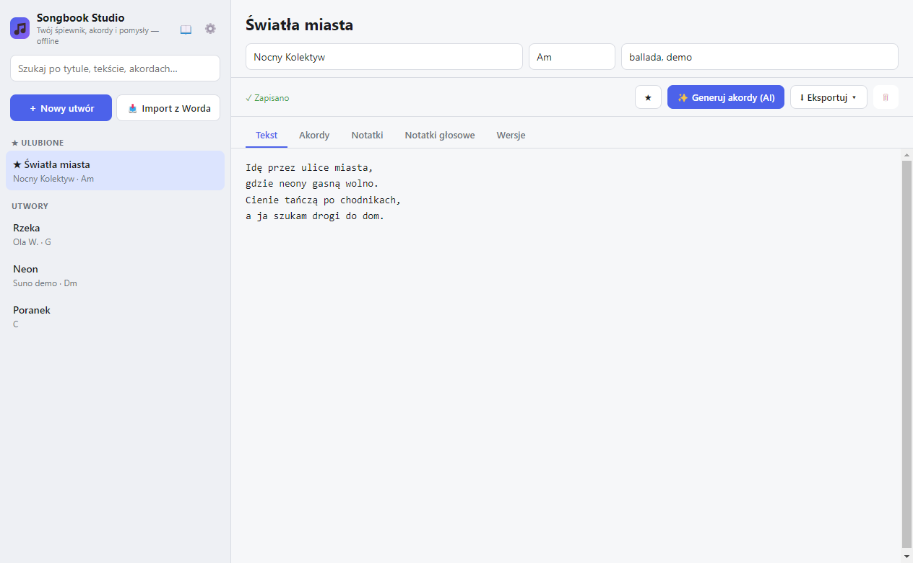
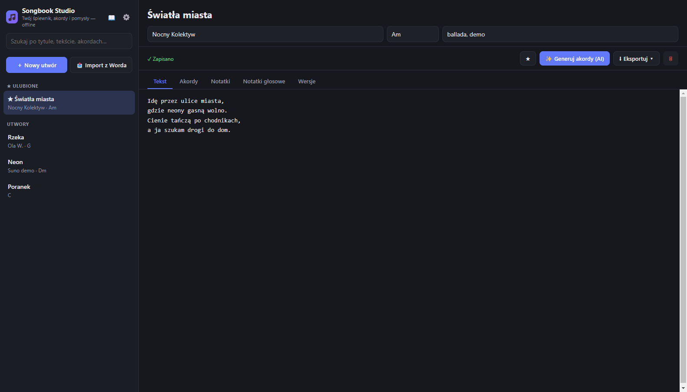

# 🎵 Songbook Studio

[](https://github.com/zetmar-collab/songbook-studio/releases/latest)
[](https://github.com/zetmar-collab/songbook-studio/releases/latest)
[](LICENSE)

Desktopowa aplikacja (Windows `.exe`) do organizowania **tekstów piosenek, akordów i pomysłów na utwory**. Działa **offline**, z opcjonalnym generowaniem akordów przez AI.

Zbudowana w **Electron + React + TypeScript + SQLite**.

## 📥 Instalacja (dla użytkowników)

1. Przejdź do **[najnowszego wydania](https://github.com/zetmar-collab/songbook-studio/releases/latest)**.
2. Pobierz plik z sekcji **Assets**:
   - **`Songbook-Studio-1.0.0-x64.exe`** — instalator (zalecane: skróty w menu Start i na pulpicie, automatyczne aktualizacje), **lub**
   - **`Songbook-Studio-1.0.0-portable.exe`** — wersja przenośna, uruchamiana bez instalacji (np. z pendrive'a).
3. Uruchom pobrany plik. Przy pierwszym starcie Windows SmartScreen może pokazać ostrzeżenie (aplikacja nie jest podpisana certyfikatem) — kliknij **„Więcej informacji" → „Uruchom mimo to"**.
4. Gotowe! Aplikacja działa offline. Aby korzystać z generowania akordów przez AI, wklej klucz API w **⚙️ Ustawienia** (OpenRouter lub Gemini) — jest przechowywany tylko lokalnie.

> 💡 Programiści i osoby chcące zbudować aplikację ze źródeł — instrukcje poniżej w sekcji *Uruchomienie w trybie deweloperskim*.

## Zrzuty ekranu

| Motyw jasny | Motyw ciemny |
|:---:|:---:|
|  |  |

## Funkcje

- 📚 **Katalog utworów** — tytuł, wykonawca, tonacja, tagi, ulubione
- 🕘 **Wersjonowanie tekstów** — zapisuj migawki i przywracaj wcześniejsze wersje
- 🎙 **Notatki głosowe** — nagrywaj pomysły na melodię prosto w aplikacji
- ✨ **Automatyczne akordy z AI** — OpenRouter lub Google Gemini
- 🆓 **Lista darmowych modeli OpenRouter** — po wklejeniu klucza API pobierana automatycznie do wyboru z listy
- 🎚 **Transpozycja akordów** — przyciski ♭−1 / ♯+1 transponują akordy w nawiasach `[ ]` i tonację
- 📥 **Import z Worda (.docx)** — wczytaj istniejący tekst jako nowy utwór (bez zewnętrznych zależności)
- 📄 **Eksport do PDF, DOCX i Markdown** (pojedynczy utwór)
- 📖 **Eksport zbiorczy** — cały śpiewnik do jednego PDF/DOCX/MD (okładka + spis treści)
- ⬆ **Automatyczne aktualizacje** (electron-updater)
- 🔍 **Wyszukiwanie pełnotekstowe** (SQLite FTS5) po tytule, tekście i akordach — także bez polskich znaków diakrytycznych
- 💾 **Kopie zapasowe bazy** — ręczne (utwórz / przywróć) oraz automatyczne przy zamknięciu (10 ostatnich)
- 🌗 **Jasny / ciemny / systemowy motyw**
- 🌍 **Język PL / EN**

## Wymagania

- Node.js 18+ (zalecane 20+)
- Windows (build produkcyjny celuje w Windows x64)

## Uruchomienie w trybie deweloperskim

```bash
npm install
npm run dev
```

> Przy pierwszym `npm install` uruchamiany jest `electron-builder install-app-deps`,
> który kompiluje natywny moduł `better-sqlite3` pod używaną wersję Electrona.

## Budowanie pliku .exe

```bash
# Instalator NSIS + wersja portable (x64)
npm run dist

# Tylko wersja portable
npm run dist:portable
```

Gotowe pliki znajdziesz w katalogu `dist/`:

- `Songbook Studio-1.0.0-x64.exe` — instalator NSIS (~82 MB)
- `Songbook Studio-1.0.0-portable.exe` — wersja przenośna (bez instalacji)

> ⚠️ Instalator nie jest podpisany certyfikatem. Przy pierwszym uruchomieniu
> Windows SmartScreen może pokazać ostrzeżenie — kliknij „Więcej informacji" →
> „Uruchom mimo to". Aby usunąć ostrzeżenie na stałe, potrzebny jest certyfikat
> podpisywania kodu (Code Signing Certificate).

## Konfiguracja AI

Klucze API wpisujesz w aplikacji: **⚙️ Ustawienia → Dostawca AI**.
Są przechowywane lokalnie (baza SQLite w katalogu danych użytkownika) i nigdy nie opuszczają Twojego komputera poza wywołaniem wybranego dostawcy.

- **OpenRouter** — klucz z https://openrouter.ai/keys (domyślny model: `google/gemini-2.0-flash-exp:free`)
- **Gemini** — klucz z https://aistudio.google.com/app/apikey (domyślny model: `gemini-2.0-flash`)

## Automatyczne aktualizacje

Aplikacja używa **electron-updater**. Po starcie (tylko w wersji zainstalowanej)
sprawdza serwer aktualizacji; nową wersję pobiera w tle, a po jej pobraniu pokazuje
baner „Uruchom ponownie, aby zainstalować". Ręcznie: ⚙️ Ustawienia → Aktualizacje →
„Sprawdź aktualizacje".

Aby aktualizacje działały, ustaw provider w [electron-builder.yml](electron-builder.yml)
(`publish:`) i publikuj nowe wydania:

**Wariant A — własny hosting (generic):**

```yaml
publish:
  provider: generic
  url: https://twoj-serwer.pl/songbook-updates/
```

Po `npm run dist` wgraj na ten adres pliki z `dist/`: instalator `.exe`,
`latest.yml` oraz `*.blockmap`. Podbij `version` w `package.json` przy każdym wydaniu.

**Wariant B — GitHub Releases:**

```yaml
publish:
  provider: github
  owner: twoj-login
  repo: songbook-studio
```

Publikuj: `npx electron-builder --win --publish always` (wymaga `GH_TOKEN`).

> Bez skonfigurowanego serwera aplikacja działa normalnie — sprawdzanie aktualizacji
> po prostu nic nie znajdzie (błędy są wyciszane).

## Gdzie trzymane są dane?

Wszystko lokalnie, w katalogu danych aplikacji:

- `songbook.db` — baza SQLite (utwory, wersje, ustawienia)
- `voice-notes/` — pliki nagrań `.webm`

Ścieżka: `%APPDATA%\songbook-studio\` (Windows).

## Architektura

```
src/
  main/        Proces główny Electrona (Node)
    db.ts        SQLite + FTS5, CRUD, wersje, notatki, ustawienia
    ai.ts        Integracja OpenRouter / Gemini
    export.ts    Eksport PDF (printToPDF) / DOCX (docx) / Markdown
    ipc.ts       Handlery IPC
    index.ts     Okno, motyw
  preload/     Bezpieczny most contextBridge (contextIsolation ON)
  renderer/    UI React + i18next + motywy CSS
```

## Rozwiązywanie problemów

### `npm install` zawodzi na `better-sqlite3` (gyp / MSBuild)

`better-sqlite3` to moduł natywny. Jeśli na komputerze nie ma pełnego toolchainu
C++ (Visual Studio Build Tools z „Desktop development with C++"), kompilacja ze
źródeł się nie powiedzie. Nie trzeba kompilować — wystarczy pobrać gotowy binarny
build dla używanej wersji Electrona:

```bash
# 1. Zainstaluj zależności bez uruchamiania skryptów build
npm install --ignore-scripts

# 2. Pobierz binaria Electrona (postinstall został pominięty)
node node_modules/electron/install.js

# 3. Pobierz gotowy build better-sqlite3 dla Twojej wersji Electrona
#    (sprawdź wersję: node -p "require('./node_modules/electron/package.json').version")
cd node_modules/better-sqlite3
npx prebuild-install -r electron -t 33.4.11 --arch x64
cd ../..
```

Alternatywnie zainstaluj **Visual Studio Build Tools** (workload „Desktop
development with C++") i wtedy zwykłe `npm install` skompiluje moduł samodzielnie.

## Bezpieczeństwo

- `contextIsolation: true`, `nodeIntegration: false`, `sandbox` z preloadem
- Renderer komunikuje się z systemem tylko przez zdefiniowane kanały IPC
- Ścisła Content-Security-Policy w `index.html`
- Zewnętrzne linki otwierane w domyślnej przeglądarce, nie w oknie aplikacji

## Licencja

[MIT](LICENSE) © 2026 Marek
